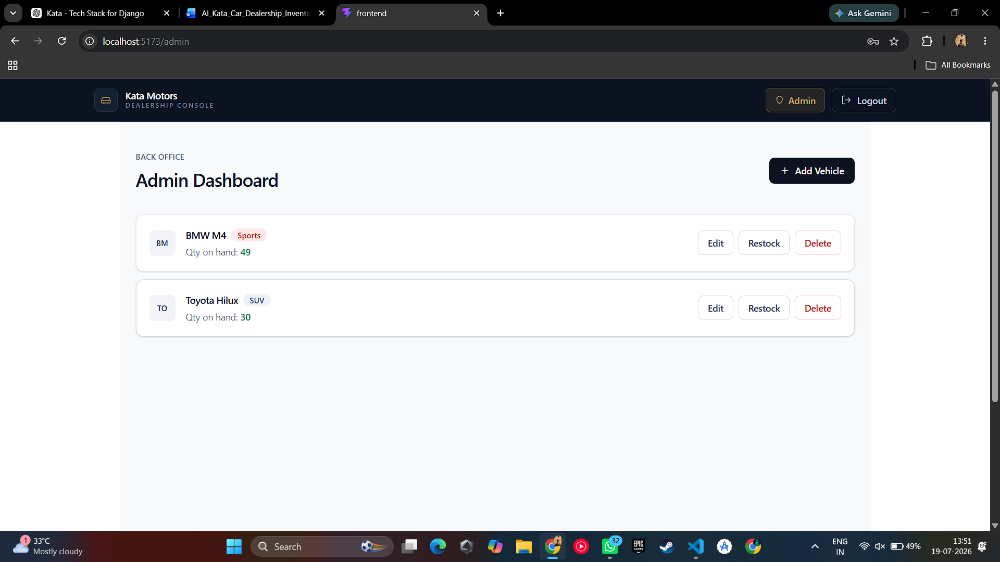
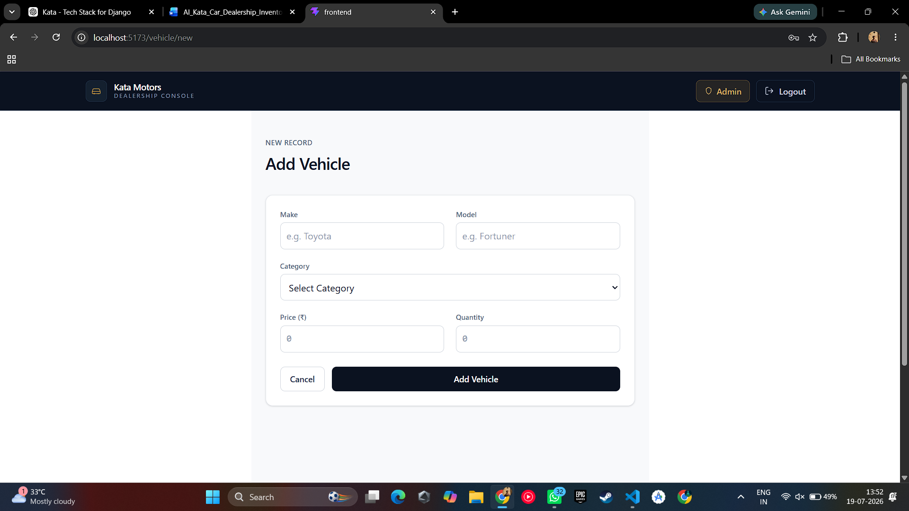
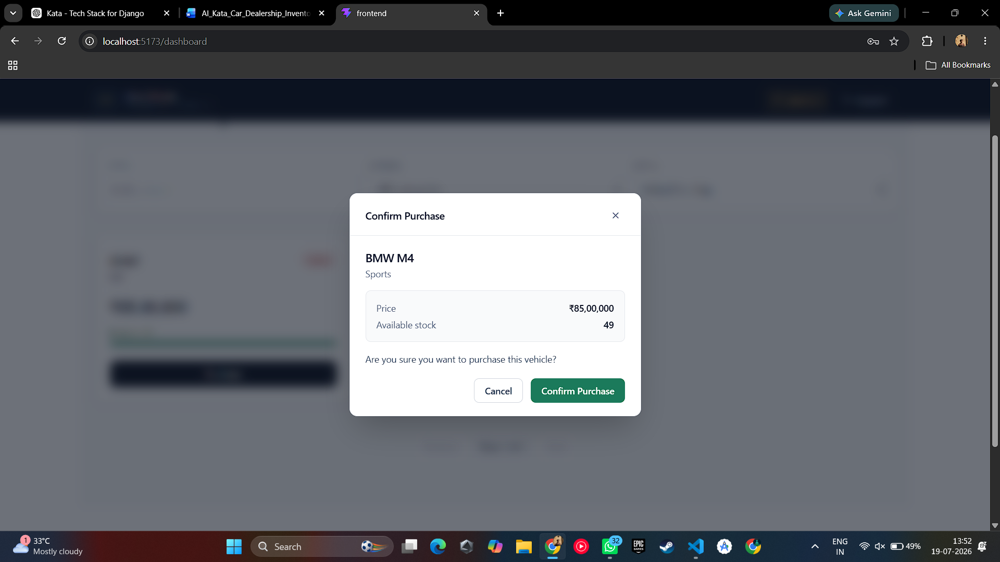

# 🚗 Kata Motors

A full-stack **Vehicle Inventory Management System** built with **React**, **Django REST Framework**, and **PostgreSQL**.

The system provides secure JWT authentication, role-based access control, vehicle inventory management, stock operations, search, filtering, sorting, pagination, and a responsive modern user interface.

---

# Features

## Authentication

- JWT Authentication
- User Registration & Login
- Access Token + Refresh Token
- Protected Routes
- Role-based Authorization (Admin / Customer)
- Persistent Login

---

## Customer Features

- Browse Vehicle Inventory
- Search Vehicles
- Filter by Category
- Sort by Price and Quantity
- Pagination
- Purchase Confirmation Modal
- Live Inventory Updates

---

## Admin Features

- Admin Dashboard
- Add Vehicle
- Edit Vehicle
- Delete Vehicle
- Restock Inventory
- Duplicate Vehicle Prevention
- Client-side & Server-side Form Validation

---

## User Experience

- Responsive Design
- Modern Dashboard UI
- Loading Spinner
- Toast Notifications
- Confirmation Modals
- Empty State Screens
- Protected Navigation

---

# Tech Stack

## Frontend

- React
- React Router DOM
- Axios
- Tailwind CSS

## Backend

- Django
- Django REST Framework
- Simple JWT
- Django Filters

## Database

- PostgreSQL

---

# API Endpoints

## Authentication

```
POST   /api/auth/register/
POST   /api/auth/login/
POST   /api/token/refresh/
```

## Vehicles

```
GET    /api/vehicles/
POST   /api/vehicles/
GET    /api/vehicles/:id/
PUT    /api/vehicles/:id/
DELETE /api/vehicles/:id/
POST   /api/vehicles/:id/purchase/
POST   /api/vehicles/:id/restock/
```

---

# Project Structure

```
Kata/
│
├── accounts/
├── vehicles/
├── config/
├── frontend/
│   ├── src/
│   │   ├── api/
│   │   ├── components/
│   │   ├── context/
│   │   ├── pages/
│   │   ├── services/
│   │   └── App.jsx
│   └── package.json
│
├── manage.py
├── requirements.txt
└── README.md
```

---

# Installation

## Backend

```bash
git clone <repository-url>

cd Kata

python -m venv venv

# Windows
venv\Scripts\activate

# Linux / macOS
source venv/bin/activate

pip install -r requirements.txt

python manage.py migrate

python manage.py runserver
```

---

## Frontend

```bash
cd frontend

npm install

npm run dev
```

# Screenshots

## Login


---

## Customer Dashboard


---

## Admin Dashboard



---

## Add Vehicle



---

## Purchase Confirmation



---

# My AI Usage

## AI Tools Used

During the development of this project, I used:

- **ChatGPT (OpenAI)** – Primary AI assistant

---

## How I Used AI

AI was used as a development assistant throughout the project.

### Project Planning

- Discussed the project architecture.
- Planned the separation between the React frontend and Django REST backend.
- Explored best practices for authentication and project organization.

### Backend Development

AI assisted with:

- JWT Authentication using SimpleJWT
- Django REST Framework concepts
- API endpoint design
- Serializer validation
- Search, filtering, sorting and pagination
- Permission classes
- PostgreSQL configuration
- Debugging backend issues

### Frontend Development

AI assisted with:

- React component structure
- React Context API for authentication
- Protected routing
- API integration using Axios
- UI improvements using Tailwind CSS
- Toast notifications
- Loading spinner
- Confirmation modals
- Empty state design
- Form validation

### Debugging

AI helped identify and resolve issues such as:

- JWT token expiration
- Authentication flow
- React state management
- API integration
- Form validation
- Duplicate vehicle prevention
- Modal behavior
- Database configuration

---

## Reflection

AI significantly improved my development workflow by acting as a learning companion and technical assistant. It helped me understand unfamiliar concepts more quickly, explore different implementation approaches, and debug issues efficiently.

I used AI responsibly by reviewing every suggestion, testing all generated code, and making implementation decisions myself. AI accelerated development and learning, but the overall system design, feature integration, testing, debugging, and final implementation were completed by me.

---

# Author

**Chhayanshu Lathiya**

- MCA Student
- Full Stack Developer

---
